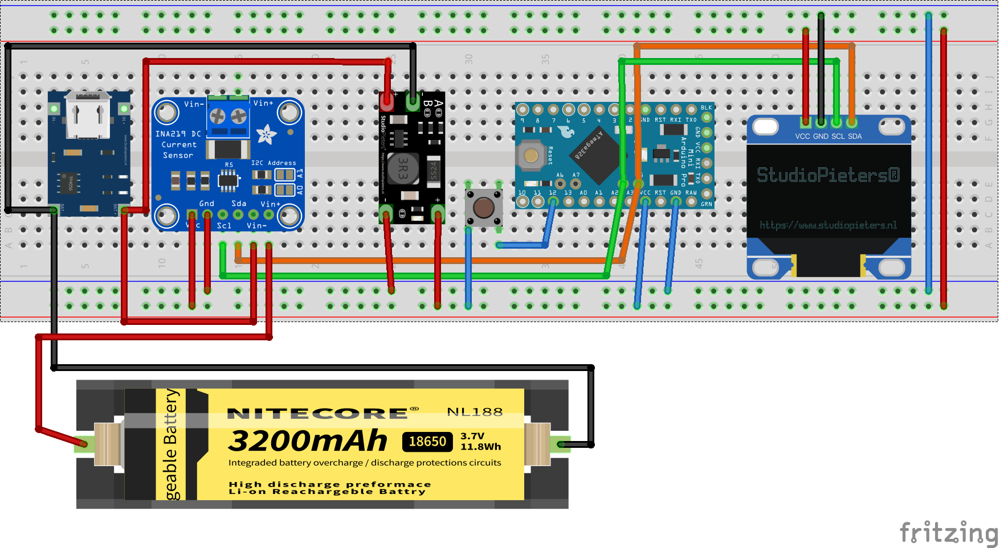

# Cool ARduino OLED INA (CAROLINA) Power Supply

## Required Libraries

- [Adafruit INA219 Library](https://github.com/adafruit/Adafruit_INA219)
- [Adafruit_SSD1306](https://github.com/adafruit/Adafruit_SSD1306)

## Required components

- [Ino219](https://amzn.eu/d/3QuVU3i)
- [Step Up Voltage Regulator](https://amzn.eu/d/afUQF4Y)
- [LiPo Charger](https://amzn.eu/d/0iJ7O1c)
- [Arduino Pro Mini](https://amzn.eu/d/iAJaFiw)
- [Oled Display I2C SSD 1306](https://amzn.eu/d/4TX7DLg)
- [Wires](https://amzn.eu/d/hLFix1U)
- [Button](https://amzn.eu/d/axoMDhK)

Optional

- [CP2102 Usb to Ttl converter](https://amzn.eu/d/5aExTal) (for Arduino programming)
- Lipo 18560 Battery (or any other Litium battery)
- [Holder for Lipo 18560 battery](https://amzn.eu/d/aiqgOFm) (if you use 18560 form factor)
- [Terminal Block Screw Terminal Connector](https://amzn.eu/d/h3pGn2i)
- [Breadboard](https://amzn.eu/d/hLFix1U)

## Wiring

## Links

[Description in my blog in Russian](http://maxistar.ru/projects/powersupply/)
